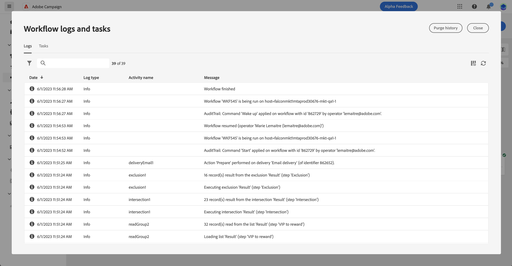

# Iniciar e monitorar os workflows {#start-monitor}

Depois de criar o fluxo de trabalho e projetar as tarefas a serem executadas na tela, é possível iniciá-lo e monitorar como ele está sendo executado.

## Iniciar o fluxo de trabalho {#start}

Para iniciar o fluxo de trabalho, navegue até o **[!UICONTROL Fluxos de trabalho]** ou na campanha associada e clique no link **[!UICONTROL Início]** no canto superior direito da tela.

Quando o fluxo de trabalho estiver em execução, cada atividade na tela será executada em ordem sequencial, até que o final do fluxo de trabalho seja atingido.

Você pode acompanhar o progresso de perfis direcionados em tempo real usando um fluxo visual. Isso permite identificar rapidamente o status de cada atividade e o número de perfis em transição entre elas.

## Transições de fluxo de trabalho {#transitions}

Nos workflows, os dados transportados de uma atividade para outra por meio de transições são armazenados em uma tabela de trabalho temporária. Esses dados podem ser exibidos para cada transição. Para fazer isso, selecione uma transição para abrir as propriedades no lado direito da tela.

* Clique em **[!UICONTROL Visualizar esquema]** para exibir o schema da tabela de trabalho.
* Clique em **[!UICONTROL Visualizar resultados]** para visualizar os dados transportados na transição selecionada.

## Monitorar execução da atividade {#activities}

Os indicadores visuais no canto superior direito de cada caixa de atividade permitem verificar a execução:

| Indicador visual | Descrição |
|-----|------------|
| {width="70%"} | A atividade está sendo executada no momento. |
| {width="70%"} | A atividade requer sua atenção. Isso pode envolver a confirmação do envio de um delivery ou a tomada de uma ação necessária. |
| {width="70%"} | A atividade encontrou um erro. Para resolver o problema, abra os logs do fluxo de trabalho para obter mais informações. |
| {width="70%"} | A atividade foi executada com sucesso. |

## Monitorar logs e tarefas {#logs-tasks}

O monitoramento de logs e tarefas de fluxos de trabalho é uma etapa essencial para analisar seus fluxos de trabalho e verificar se eles estão sendo executados corretamente. Elas podem ser acessados pelo **[!UICONTROL Logs]** ícone que está disponível na barra de ferramentas da ação e no painel de propriedades de cada atividade.

A variável **[!UICONTROL Logs e tarefas]** O menu fornece um histórico da execução do fluxo de trabalho, registrando todas as ações do usuário e encontrando erros. Esse histórico é salvo pela duração especificada no workflow [opções de execução](workflow-settings.md). Durante essa duração, todas as mensagens são salvas, mesmo após uma reinicialização do workflow. Se não quiser salvar as mensagens de uma execução anterior, clique no link **[!UICONTROL Purge history]** botão.

Dois tipos de informações estão disponíveis:

* A variável **[!UICONTROL Log]** contém o histórico de execução de todas as atividades do workflow. Ele indexa as operações realizadas e os erros de execução por ordem cronológica.
* A variável **[!UICONTROL Tarefas]** A guia detalha a sequência de execução das atividades.

Em ambas as guias, você pode escolher as colunas exibidas e sua ordem, aplicar filtros e usar o campo de pesquisa para localizar rapidamente as informações desejadas.

## Comandos de execução de workflow {#execution-commands}

A barra de ação no canto superior direito fornece comandos que permitem gerenciar a execução do workflow. Você pode:

* **[!UICONTROL Início]** / **[!UICONTROL Retomar]** a execução do workflow, que assume o status In progress. Se o workflow tiver sido pausado, ele será retomado, caso contrário, será iniciado e as atividades iniciais serão ativadas.

* **[!UICONTROL Pausar]** a execução do workflow, que assume o status Paused. Nenhuma nova atividade será ativada até que seja retomada, mas as operações em andamento não são suspensas.

* **[!UICONTROL Parar]** um workflow que está sendo executado, que assumirá o status Finished. Se possível, as operações em andamento são interrompidas. Não é possível retomar do fluxo de trabalho a partir do mesmo local em que ele foi interrompido.
