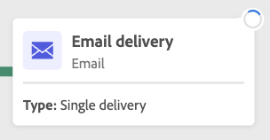

# Iniciar e monitorar a execução do fluxo de trabalho {#start-monitor}

Depois de criar o fluxo de trabalho e projetar as tarefas a serem executadas na tela, é possível iniciá-lo e monitorar como ele está sendo executado.

## Iniciar o fluxo de trabalho {#start}

Para iniciar o fluxo de trabalho, abra-o no menu Workflows ou na campanha associada e clique no botão Start no canto superior direito da tela.

Quando o fluxo de trabalho estiver em execução, cada atividade na tela será executada em ordem sequencial, até que o final do fluxo de trabalho seja atingido.

Você pode acompanhar em tempo real o progresso dos perfis direcionados no fluxo de trabalho graças a um fluxo visual. Isso permite identificar rapidamente o status de cada atividade e quantos perfis estão navegando em cada transição.

>[!NOTE]
>
>Você pode desativar o fluxo visual usando o botão Ocultar progressão na barra de ferramentas superior da tela.

## Monitorar a execução de atividades {#activities}

Os indicadores visuais no canto superior direito de cada atividade permitem verificar a execução:

| Indicador visual | Descrição |
|-----|------------|
|  | A atividade está sendo executada. |
|  | A atividade requer sua atenção. Alguma ação pode ser necessária, como por exemplo, confirmar o envio de um delivery. |
|  | A atividade encontrou um erro. Abra os logs de fluxo de trabalho para obter mais informações e resolver o problema. |
|  | A atividade foi executada com sucesso. |

## Monitorar logs e tarefas

## Pausar e parar um fluxo de trabalho

* pausar/interromper o fluxo de trabalho. retomar um fluxo de trabalho após ser pausado.