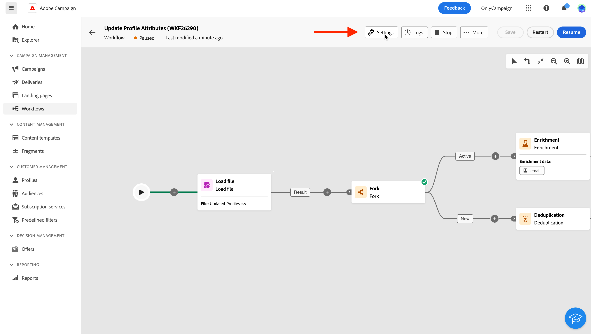

# Definir as configurações do workflow {#workflow-settings}

Ao orquestrar atividades de workflow na tela, você pode acessar configurações avançadas relacionadas ao workflow. Por exemplo, é possível definir um fuso horário específico para o workflow, gerenciar como o workflow deve se comportar em caso de erro ou gerenciar o atraso após o qual o histórico do workflow deve ser removido.

Essas configurações são pré-definidas no template selecionado ao criar o workflow, mas podem ser editadas conforme necessário para esse workflow específico.

Para fazer isso, clique no link **[!UICONTROL Configurações]** botão disponível na barra de ações acima da tela do fluxo de trabalho.

{zoom=&quot;yes&quot;}{width="70%" align="left"}

## Propriedades do fluxo de trabalho {#properties}

>[!CONTEXTUALHELP]
>id="acw_workflow_settings_properties"
>title="Propriedades do fluxo de trabalho"
>abstract="Esta seção fornece propriedades genéricas de fluxo de trabalho que também podem ser acessadas ao criar o fluxo de trabalho. É possível escolher o modelo a ser usado para criar o fluxo de trabalho e especificar um rótulo. Expanda a seção Opções adicionais para definir configurações específicas, como a pasta de armazenamento do fluxo de trabalho ou o fuso horário."

A variável **[!UICONTROL Propriedades]** fornece configurações genéricas que também podem ser acessadas ao criar o workflow.

{zoom=&quot;yes&quot;}{width="70%" align="left"}

Essas propriedades são:

* A variável **[!UICONTROL Rótulo]** do fluxo de trabalho exibido na lista.
* A variável **[!UICONTROL Nome interno]** do workflow.
* A variável **[!UICONTROL Pasta]** onde o workflow deve ser salvo.
* O padrão **[!UICONTROL Fuso horário]** para usar em todas as atividades do workflow. Por padrão, o fuso horário do workflow é aquele definido para o operador atual do Campaign.
Os valores possíveis são:
   * **Fuso horário do servidor** para usar o fuso horário do servidor de aplicativos Adobe Campaign
   * **Fuso horário do operador** para usa o fuso horário do operador do Adobe Campaign que executa o fluxo de trabalho, conforme definido no perfil do operador, no console do cliente
   * **Fuso horário do banco de dados** para usar o fuso horário do servidor de banco de dados
   * Um fuso horário específico
* Quando um workflow falha, os operadores pertencentes ao grupo de operadores selecionado no **[!UICONTROL Supervisor(es)]** são notificados por email.
* Você também pode inserir um **[!UICONTROL Descrição]** do seu fluxo de trabalho.

Quando o fluxo de trabalho é [associado a uma campanha](create-workflow.md), ele é exibido no **[!UICONTROL Campanha vinculada]** campo. Você pode abrir a campanha associada nesse campo.

## Configurações de segmentação  {#segmentation-settings}

>[!CONTEXTUALHELP]
>id="acw_workflow_settings_segmentation"
>title="Configurações de segmentação"
>abstract="Nesta seção, você pode selecionar o targeting dimension para direcionar perfis no fluxo de trabalho e escolher manter os resultados do fluxo de trabalho entre duas execuções. Essa opção deve ser usada somente para fins de teste e nunca deve ser habilitada em um fluxo de trabalho de produção."

* **[!UICONTROL Dimensão de direcionamento]**: selecione a targeting dimension a ser usada para direcionar perfis: recipients, beneficiários de contrato, operadores, assinantes, etc. [Saiba mais sobre targeting dimensions](../audience/targeting-dimensions.md)

* **[!UICONTROL Manter o resultado de públicos provisórios entre duas execuções]**: por padrão, somente as tabelas de trabalho da última execução do workflow são mantidas. As tabelas de trabalho das execuções anteriores são removidas por um workflow técnico, executado diariamente.

  Se essa opção estiver ativada, as tabelas de trabalho serão mantidas mesmo após a execução do workflow. Você pode usá-lo para fins de teste e, portanto, deve ser usado **somente** em ambientes de desenvolvimento ou de preparo. Nunca deve ser verificado em um workflow de produção.

## Configurações de execução  {#exec-settings}

>[!CONTEXTUALHELP]
>id="acw_workflow_settings_execution"
>title="Configurações de execução"
>abstract="Nesta seção, é possível definir configurações relacionadas à execução do fluxo de trabalho, de modo que o número de dias do histórico do fluxo de trabalho seja mantido."

* **[!UICONTROL Histórico em dias]**: especifica o número de dias após os quais o histórico deve ser limpo. O histórico contém elementos relacionados ao workflow: logs, tarefas, eventos (objetos técnicos vinculados à operação do workflow). O valor padrão é de 30 dias para modelos de fluxo de trabalho prontos para uso. A limpeza do histórico é executada pelo fluxo de trabalho técnico de limpeza do banco de dados, que é executado todos os dias por padrão

  >[!IMPORTANT]
  >
  >Se o campo **[!UICONTROL Histórico em dias]** for deixado em branco, o valor “1” será considerado, o que significa que o histórico será removido após 1 dia.

* **[!UICONTROL Afinidade padrão]**: se a instalação incluir vários servidores de workflow, use esse campo para especificar o servidor no qual o workflow será executado. Isso força a execução desse workflow em um servidor específico. Você pode escolher qualquer nome de afinidade existente, mas não use espaços ou sinais de pontuação. Se você usar servidores diferentes, especifique nomes diferentes, separados por vírgulas.

  >[!IMPORTANT]
  >
  >Se o valor definido nesse campo não existir em nenhum servidor, o workflow permanecerá pendente.

* **[!UICONTROL Salvar consultas SQL no log]**: marque essa opção para salvar as consultas SQL do workflow nos logs. Essa operação é reservada para usuários avançados. Aplica-se a workflows que contêm atividades de direcionamento como **[!UICONTROL Criar público-alvo]**. Quando essa opção está habilitada, as consultas SQL enviadas ao banco de dados durante a execução do workflow são exibidas nos logs do workflow, permitindo analisá-las para otimizar as consultas ou diagnosticar problemas.

## Configurações de gerenciamento de erros  {#error-settings}

>[!CONTEXTUALHELP]
>id="acw_workflow_settings_error"
>title="Configurações de gerenciamento de erros"
>abstract="Nesta seção, é possível definir como o fluxo de trabalho deve gerenciar erros durante sua execução. É possível optar por pausar o processo, ignorar um determinado número de erros ou interromper a execução do fluxo de trabalho."

* **[!UICONTROL Gerenciamento de erros]**: este campo permite que você defina as ações a serem tomadas se uma tarefa de workflow tiver erros. Há três opções possíveis:

   * **[!UICONTROL Suspender processo]**: o workflow é pausado automaticamente e seu status é alterado para **[!UICONTROL Failed]**. Quando o problema for resolvido, retome o workflow usando o **[!UICONTROL Retomar]** botões.
   * **[!UICONTROL Ignorar]**: O status da tarefa que provocou o erro muda para **[!UICONTROL Failed]**, mas o workflow mantém o **[!UICONTROL Iniciado]** status. <!-- TO ADD ONCE SCHEUDLER IS AVAILABLE This configuration is relevant for recurring tasks: if the branch includes a scheduler, it will start normally next time the workflow is executed.-->
   * **[!UICONTROL Interromper o processo]**: o workflow é interrompido automaticamente e seu status muda para **[!UICONTROL Failed]**. Quando o problema for resolvido, reinicie o workflow usando o **[!UICONTROL Início]** botões.

* **[!UICONTROL Consecutive errors]**: este campo fica disponível quando o **[!UICONTROL Ignorar]** valor estiver selecionado na variável **[!UICONTROL No caso de erros]** campo. Você pode especificar quantos erros podem ser ignorados antes que o processo seja interrompido. Após esse número ser alcançado, o status do workflow será alterado para **[!UICONTROL Failed]**. Se o valor desse campo for 0, o workflow nunca será interrompido independentemente do número de erros.
